# 📘 Módulo 02 — Introdução ao SQL Server

---

## 📌 Contexto do Módulo

Este módulo marca a transição da teoria para a prática no SQL Server, abordando desde a instalação e configuração do ambiente até a execução de comandos SQL fundamentais.

Além disso, são introduzidos conceitos essenciais para administração de banco de dados, como controle de transações, manipulação de dados, estrutura interna e criação de objetos de programação.

---

## 🎯 Objetivo

Desenvolver uma base sólida em SQL Server com foco em:

- Execução de comandos SQL (DDL e DML)  
- Manipulação e consulta de dados  
- Entendimento de tipos de dados  
- Controle de transações e consistência  
- Introdução a objetos de banco de dados  
- Fundamentos voltados para atuação como DBA  

---

## 📂 Estrutura do Módulo

```
modulo-02-introducao-sql-server/
│
├── queries/
│   ├── 01_sqlcmd.sql
│   ├── 02_linguagemsql.sql
│   ├── 03_group_by.sql
│   ├── 04_join.sql
│   ├── 05_select_basico.sql
│   ├── 06_tipos_dados_string.sql
│   ├── 07_tipos_dados_numerico.sql
│   ├── 08_tipos_dados_data.sql
│   ├── 09_atualizacao.sql
│   ├── 10_transacoes_blocking.sql
│   └── 11_objetos_programacao.sql
│
├── Imagens/
│   ├── 01_01_sqlcmd.png
│   ├── 02_01_linguagemsql.png
│   ├── 02_02_linguagemsql.png
│   ├── 03_01_group_by.png
│   ├── 04_01_join.png
│   ├── 05_01_select_basico.png
│   ├── 06_01_tipos_dados_string.png
│   ├── 07_01_tipos_dados_numerico.png
│   ├── 08_01_tipos_dados_data.png
│   ├── 09_01_atualizacao.png
│   ├── 10_01_transacoes_blocking.png
│   └── 11_01_objetos_programacao.png
│
└── README.md
```

---

## 🧠 Conceitos Abordados

### 🔹 Linguagem SQL (DDL e DML)

Durante o módulo foram utilizados comandos fundamentais:

- CREATE DATABASE / TABLE  
- INSERT, UPDATE, DELETE  
- SELECT com filtros e condições  

---

### 🔹 Consultas e Relacionamentos

- SELECT com WHERE  
- JOIN  
- GROUP BY  

---

### 🔹 Tipos de Dados

- Strings (VARCHAR, CHAR)  
- Numéricos (INT, DECIMAL)  
- Datas (DATE, DATETIME)  

---

### 🔹 Manipulação de Dados

- Inserção  
- Atualização  
- Exclusão  

---

### 🔹 Transações e Concorrência

- BEGIN TRAN  
- COMMIT  
- ROLLBACK  
- Blocking  

---

### 🔹 Objetos de Programação

- Views  
- Stored Procedures  
- Functions  
- Triggers  

---

## 📸 Evidências Práticas

### 🔹 Execução de consulta inicial

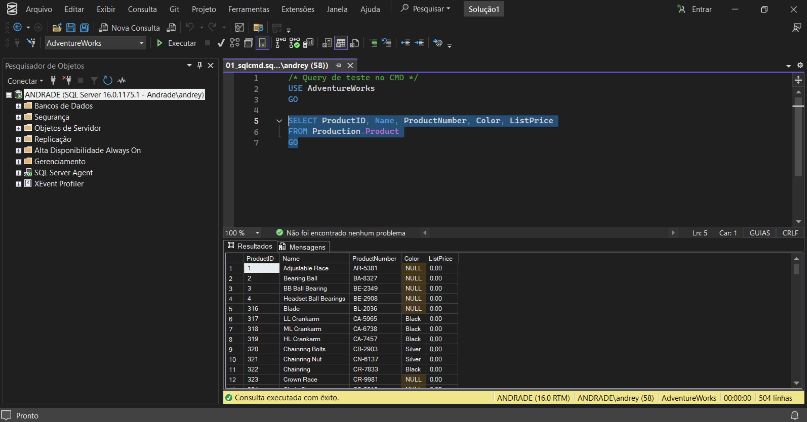

---

### 🔹 Manipulação de dados e erros

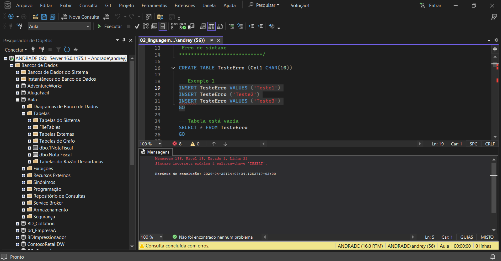

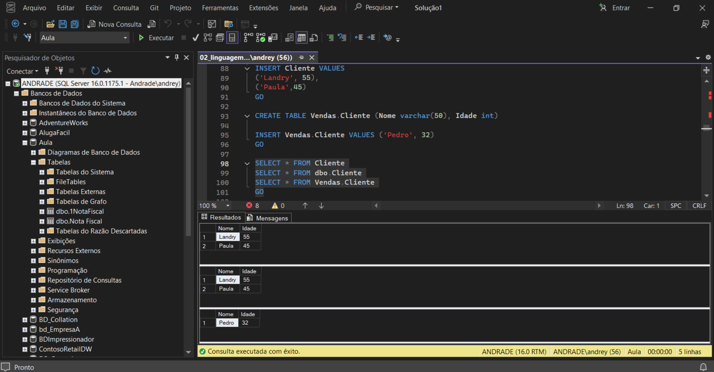

---

### 🔹 GROUP BY

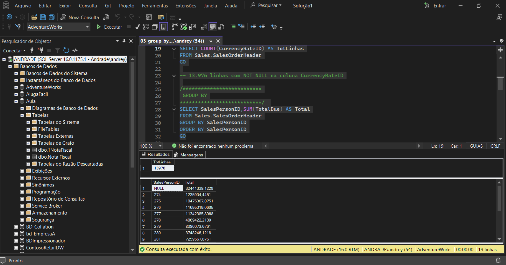

---

### 🔹 JOIN

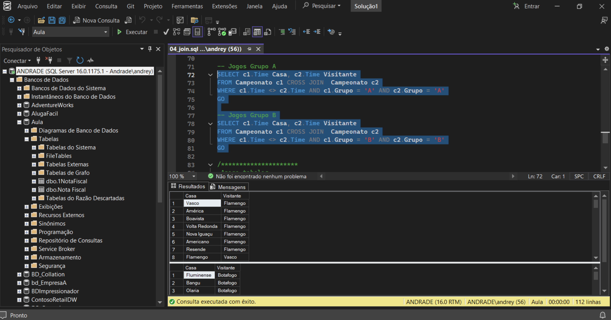

---

### 🔹 SELECT

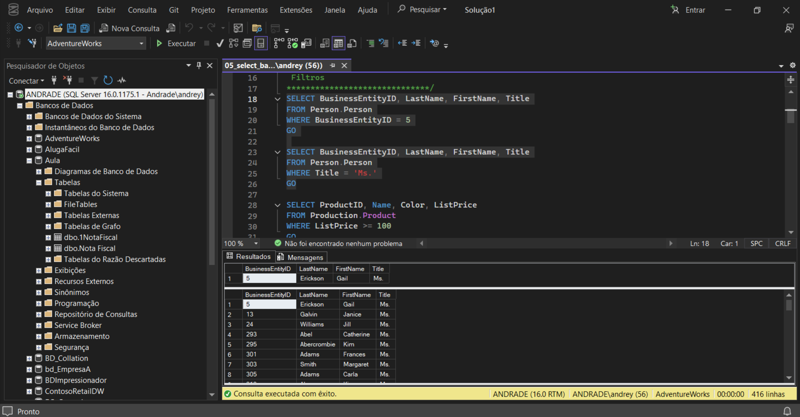

---

### 🔹 Tipos de dados

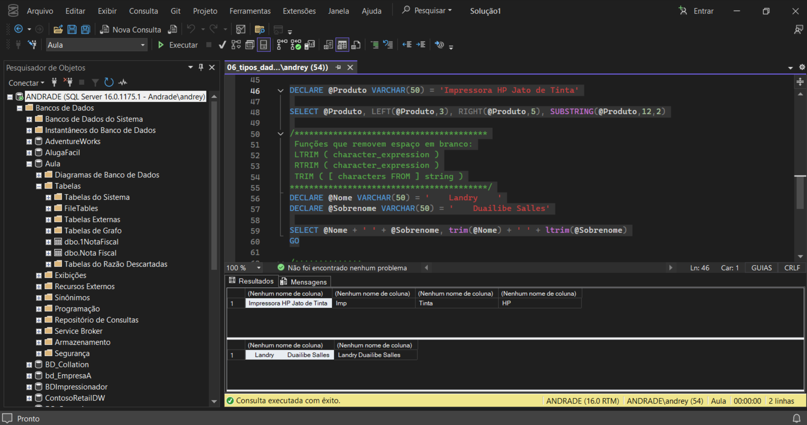

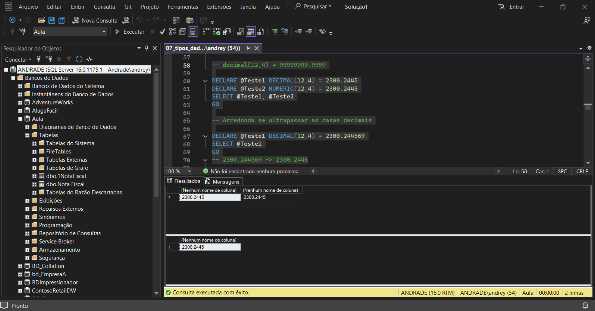

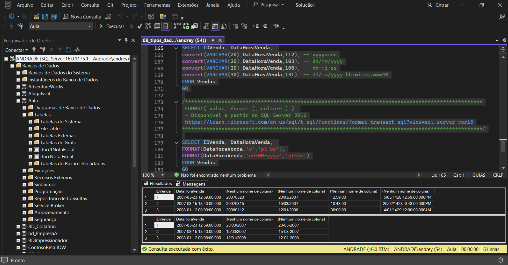

---

### 🔹 Atualização

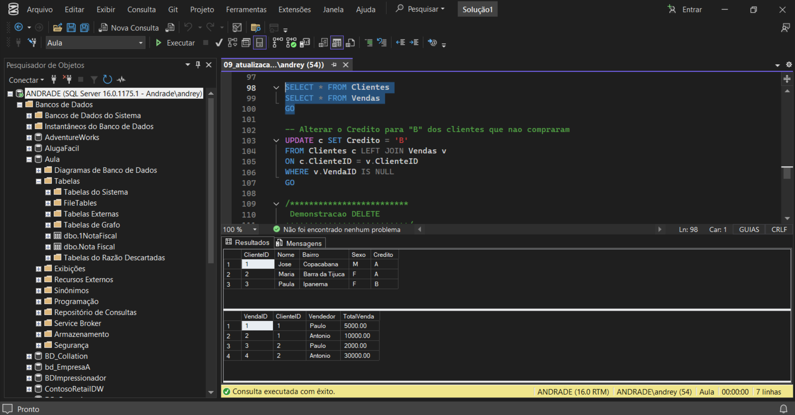

---

### 🔹 Transações

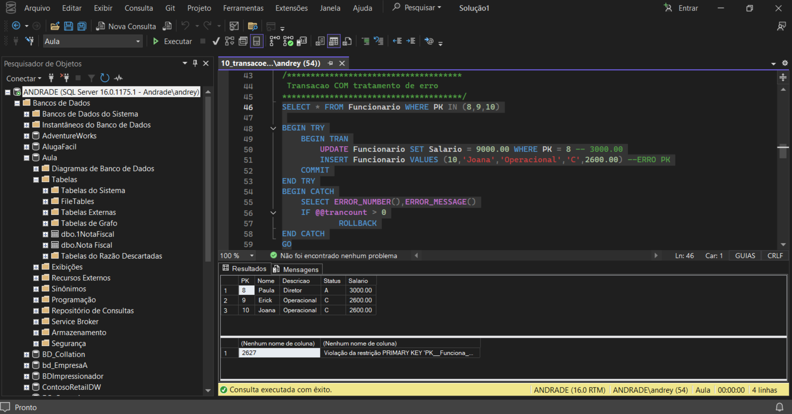

---

### 🔹 Objetos

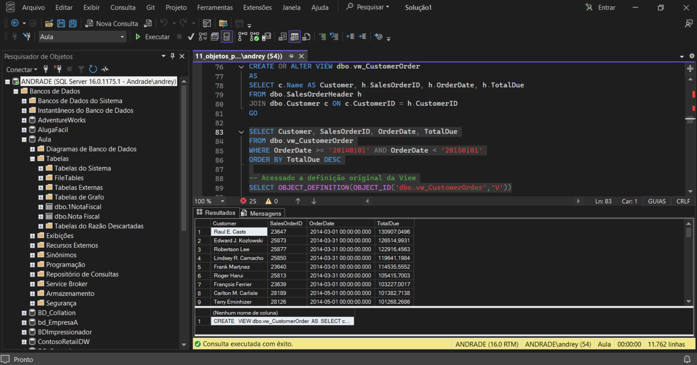

---

## 🧪 Aplicação Prática (DBA)

- Controle de dados  
- Validação de integridade  
- Gerenciamento de transações  
- Uso de objetos para automação  

---

## 📚 Aprendizados

- Execução de queries  
- Entendimento de erros  
- Manipulação de dados  
- Base para administração  

---

## 🚀 Conclusão

Base sólida para evolução em SQL Server e atuação como DBA.
