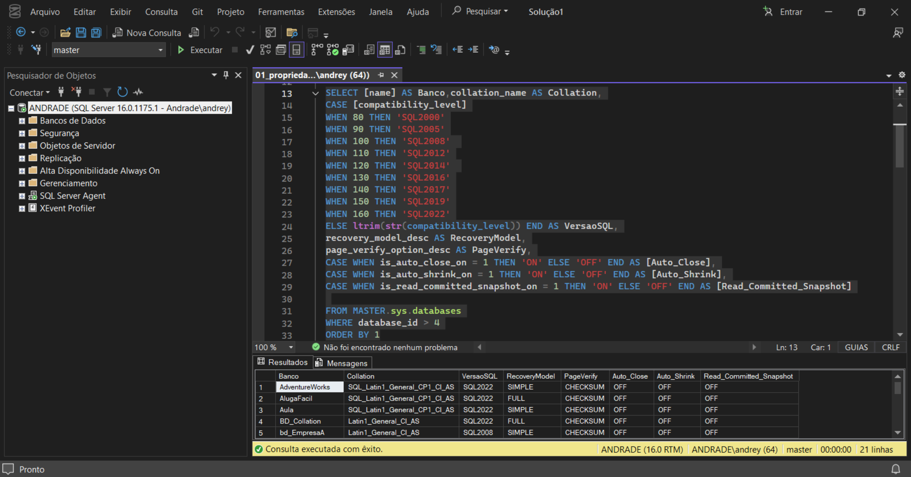
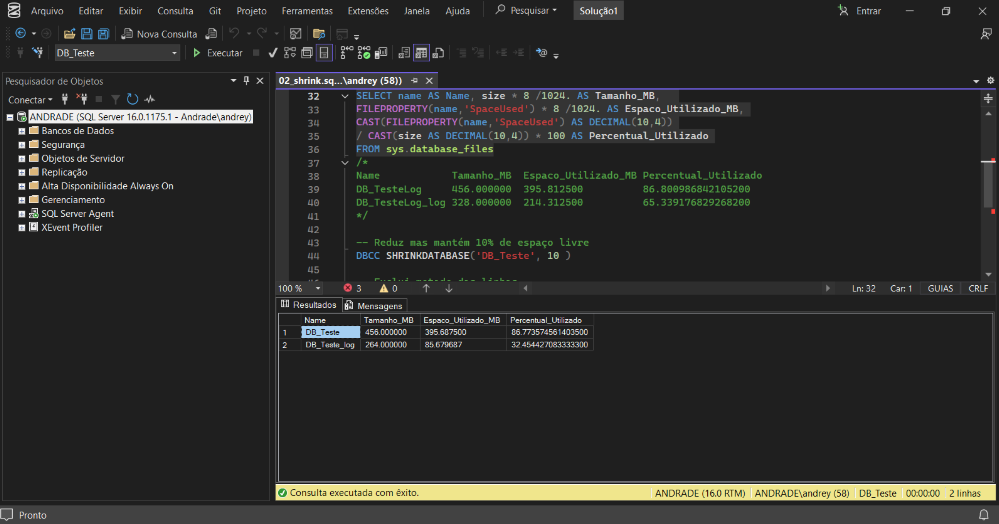
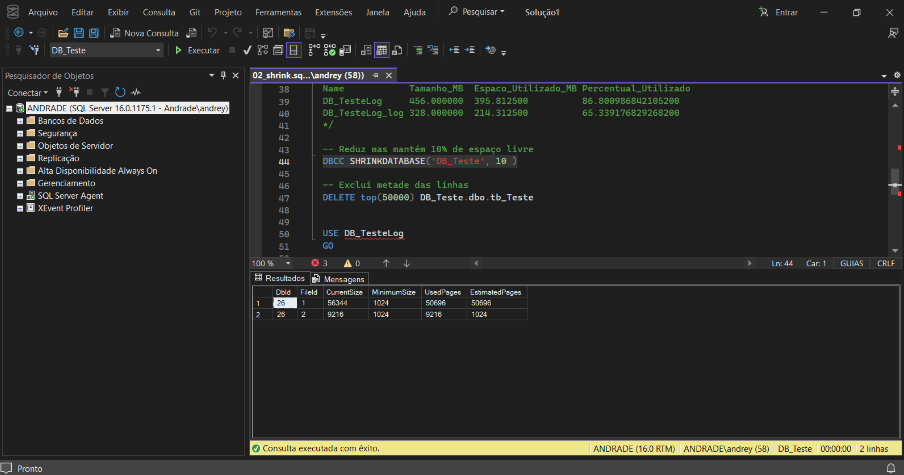
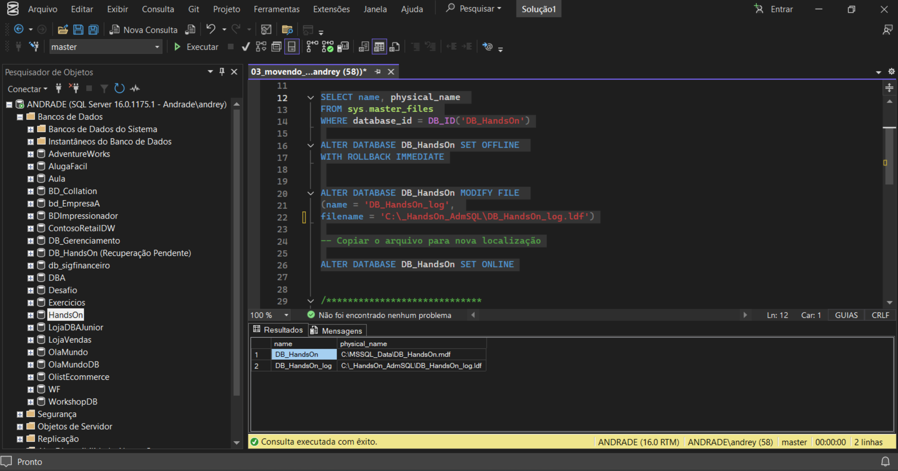
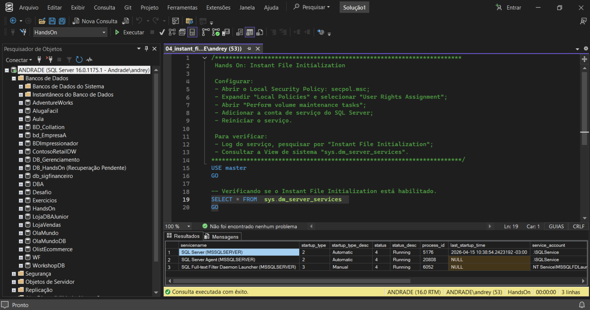
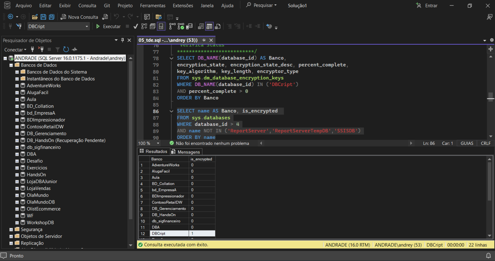
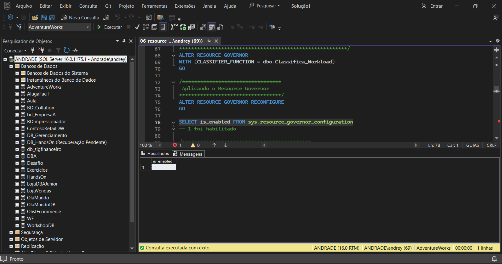

# 📘 Módulo 03 — Administrando Bancos de Dados

---

## 📌 Contexto do Módulo

Este módulo aprofunda os conhecimentos em administração do SQL Server, abordando configurações essenciais de infraestrutura, gerenciamento de arquivos, otimização de armazenamento, segurança e controle de recursos.

Diferente dos módulos anteriores, o foco aqui está diretamente relacionado às atividades práticas executadas por um DBA em ambientes corporativos, incluindo manutenção, tuning básico, organização de storage e criptografia de bancos de dados.

---

## 🎯 Objetivo

Desenvolver conhecimentos práticos em administração de bancos de dados SQL Server, com foco em:

- Gerenciamento de arquivos de dados e log  
- Configuração e manutenção de bancos  
- Otimização de armazenamento  
- Segurança com criptografia (TDE)  
- Controle de recursos do servidor  
- Performance e infraestrutura SQL Server  

---

## 📂 Estrutura do Módulo

```bash
modulo-03-administrando-bancos/
│
├── Queries/
│   ├── 01_propriedades.sql
│   ├── 02_shrink.sql
│   ├── 03_movendo_log.sql
│   ├── 04_instant_file_initialization.sql
│   ├── 05_tde.sql
│   ├── 06_resource_governor.sql
│   └── 07_resource_governor_tempdb.sql
│
├── Imagens/
│   ├── 01_01_propriedades.png
│   ├── 02_01_shrink.png
│   ├── 02_02_shrink.png
│   ├── 03_01_movendo_log.png
│   ├── 04_01_instant_file_initialization.png
│   ├── 05_01_tde.png
│   └── 06_01_resource_governor.png
│
└── README.md
```

---

# 🧠 Conceitos Abordados

## 🔹 Gerenciamento de Propriedades do Banco

Foram exploradas configurações internas e propriedades dos bancos de dados no SQL Server.

---

## 🔹 SHRINK e Gerenciamento de Espaço

Operações de SHRINK para administração de espaço e manutenção de arquivos.

---

## 🔹 Movimentação de Arquivos de LOG

Gerenciamento e alteração de localização física de arquivos `.LDF`.

---

## 🔹 Instant File Initialization (IFI)

Configuração para otimizar criação e crescimento de arquivos de dados.

---

## 🔹 Transparent Data Encryption (TDE)

Criptografia de banco utilizando certificados e TDE.

---

## 🔹 Resource Governor

Controle de consumo de CPU, memória e workloads.

---

## 🔹 Controle de TEMPDB

Gerenciamento de utilização da TEMPDB e controle de recursos.

---

# 📸 Evidências Práticas

## 🔹 Propriedades do Banco



---

## 🔹 Operações de SHRINK





---

## 🔹 Movimentação de Arquivo de LOG



---

## 🔹 Instant File Initialization



---

## 🔹 Transparent Data Encryption (TDE)



---

## 🔹 Resource Governor



---

# 🧪 Aplicação Prática (Visão de DBA)

- Gerenciamento de arquivos e storage  
- Otimização de performance  
- Controle de crescimento de bancos  
- Segurança e criptografia de dados  
- Controle de workloads e concorrência  

---

# 📚 Aprendizados

- Administração prática de SQL Server  
- Configuração de infraestrutura  
- Segurança de bancos de dados  
- Controle de recursos e performance  

---

# 🚀 Conclusão

Este módulo consolida conhecimentos fundamentais de administração, infraestrutura e segurança no SQL Server, preparando a base para tópicos avançados de DBA.
