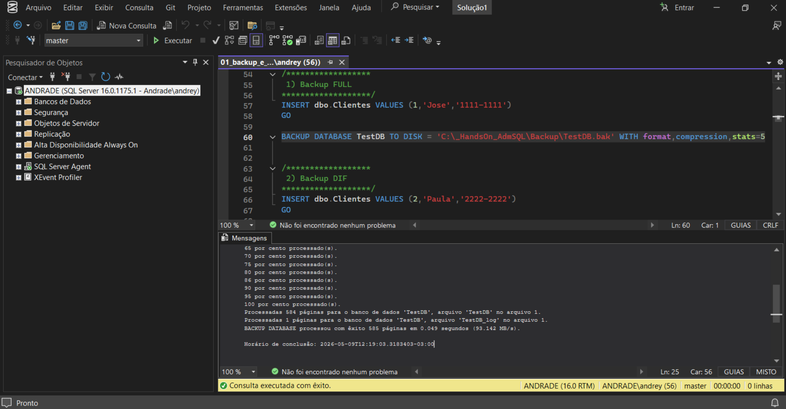
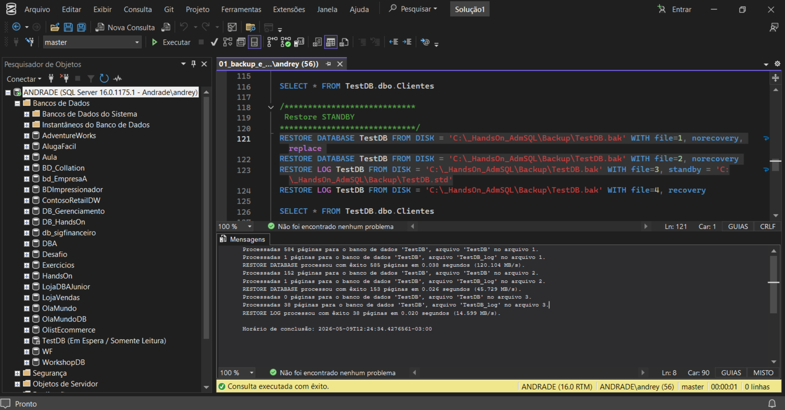
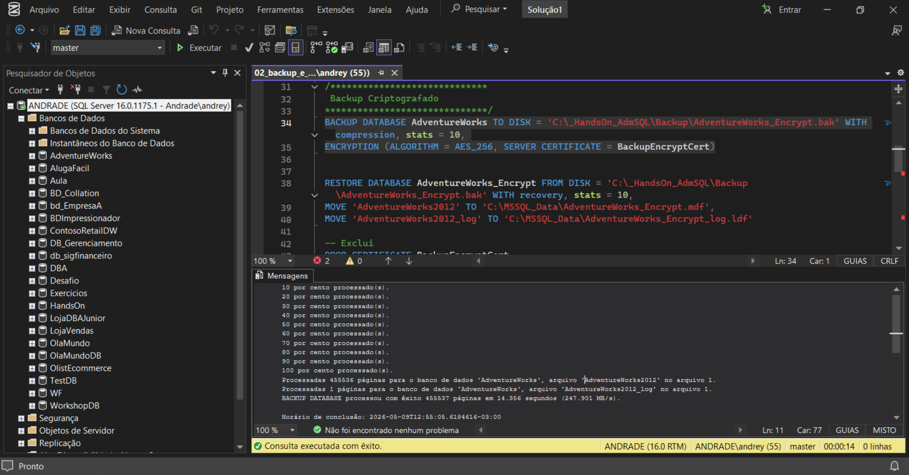
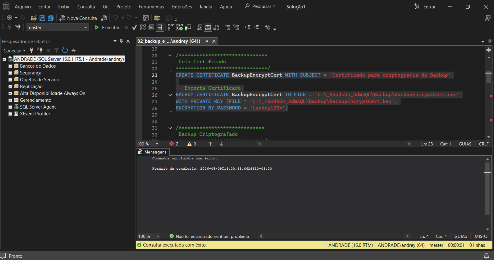
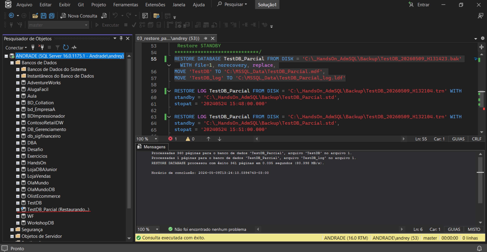
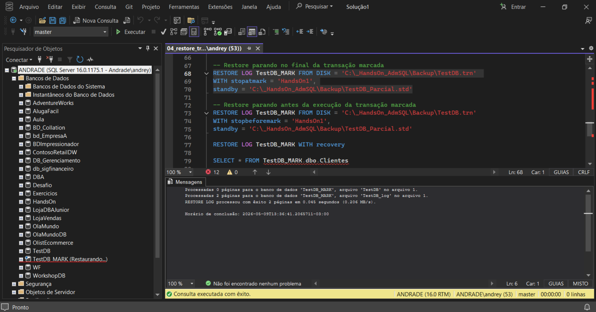
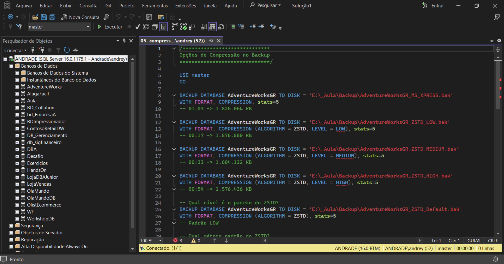

# 📘 Módulo 04 — Backup e Restore

---

## 📌 Contexto do Módulo

Este módulo aborda um dos pilares mais importantes da administração de bancos de dados SQL Server: estratégias de Backup e Restore.

Os conteúdos apresentados envolvem recuperação de desastres, continuidade de negócio, proteção de dados, recuperação ponto no tempo, criptografia de backups e operações avançadas de restore.

Durante o módulo foram realizados cenários práticos focados em ambientes corporativos, simulando operações reais executadas por DBAs em produção.

---

# 🎯 Objetivo

Desenvolver conhecimentos práticos e operacionais relacionados a:

- Estratégias de backup
- Restore de bancos de dados
- Recovery Models
- Recuperação ponto no tempo
- Restore de transações
- Criptografia de backups
- Compressão de backup
- Continuidade de negócio
- Disaster Recovery

---

# 📂 Estrutura do Módulo

```bash
modulo-04-backup-restore/
│
├── Queries/
│   ├── 01_backup_e_restore.sql
│   ├── 02_backup_e_restore_com_criptografia.sql
│   ├── 03_restore_parcial.sql
│   ├── 04_restore_transacao.sql
│   └── 05_compressao_backup.sql
│
├── Imagens/
│   ├── 01_01_backup_e_restore.png
│   ├── 01_02_backup_e_restore.png
│   ├── 02_01_backup_e_restore_com_criptografia.png
│   ├── 02_02_backup_e_restore_com_criptografia.png
│   ├── 03_01_restore_parcial.png
│   ├── 04_01_restore_transacao.png
│   └── 05_01_compressao_backup.png
│
└── README.md
```

---

# 🧠 Conceitos Abordados

## 🔹 Estratégias de Backup

Foram abordados os principais tipos de backup do SQL Server:

- Backup FULL
- Backup Diferencial
- Backup de LOG

Também foram apresentados conceitos de:
- RPO (Recovery Point Objective)
- RTO (Recovery Time Objective)

---

## 🔹 Recovery Models

Estudo dos modelos de recuperação:
- SIMPLE
- FULL
- BULK_LOGGED

Foram analisados:
- comportamento do transaction log
- recuperação ponto no tempo
- gerenciamento do arquivo LDF

---

## 🔹 Backup e Restore na Prática

Execução prática utilizando:
- BACKUP DATABASE
- RESTORE DATABASE
- RESTORE LOG

Recursos utilizados:
- COMPRESSION
- CHECKSUM
- COPY_ONLY
- INIT / NOINIT

---

## 🔹 Restore Avançado

Foram realizados cenários utilizando:
- NORECOVERY
- RECOVERY
- STOPAT
- STOPATMARK
- STOPBEFOREMARK

---

## 🔹 Restore de Transações

Aplicação de backups de LOG para recuperação sequencial de transações.

---

## 🔹 Criptografia de Backup

Implementação de criptografia utilizando:
- MASTER KEY
- CERTIFICATE
- AES_256

---

## 🔹 Compressão de Backup

Utilização de compressão nativa do SQL Server para:
- redução de espaço
- redução de I/O
- melhoria de performance

---

# 📸 Evidências Práticas

## 🔹 Backup FULL e Restore





---

## 🔹 Backup com Criptografia





---

## 🔹 Restore Parcial e STOPAT



---

## 🔹 Restore de Transações



---

## 🔹 Compressão de Backup



---

# 🧪 Aplicação Prática (Visão de DBA)

Os cenários executados neste módulo representam atividades críticas realizadas por DBAs em ambientes corporativos:

- recuperação de bancos de dados
- recuperação de desastres
- proteção de dados
- continuidade operacional
- segurança de backups
- recuperação ponto no tempo
- gerenciamento de transaction log
- otimização de armazenamento

---

# 📚 Aprendizados

Ao final deste módulo foi possível desenvolver conhecimentos em:

- Estratégias de Backup e Restore
- Recovery Models
- Restore avançado
- Recuperação de transações
- Criptografia de backup
- Continuidade de negócio
- Disaster Recovery
- Compressão e otimização de backups

---

# 🚀 Conclusão

Este módulo consolidou conhecimentos fundamentais sobre recuperação e proteção de dados no SQL Server.

Os conteúdos abordados representam operações críticas executadas diariamente por DBAs em ambientes corporativos, principalmente em cenários de recuperação de falhas, proteção contra perda de dados e continuidade operacional.

Além disso, os cenários práticos desenvolvidos neste módulo reforçam conceitos essenciais para atuação profissional em administração de bancos de dados SQL Server.
