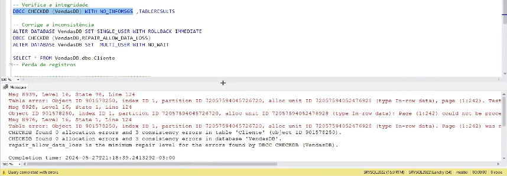
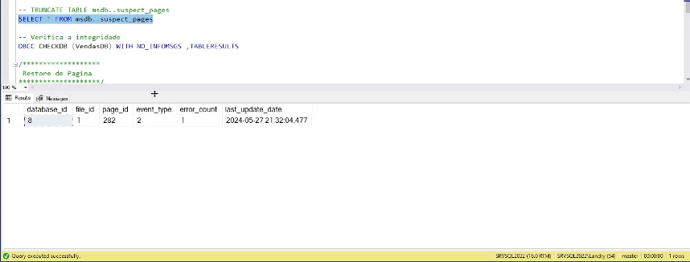
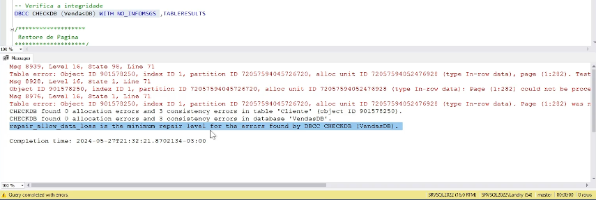
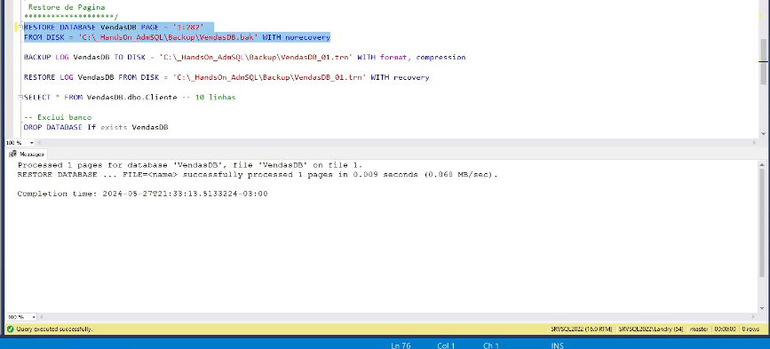
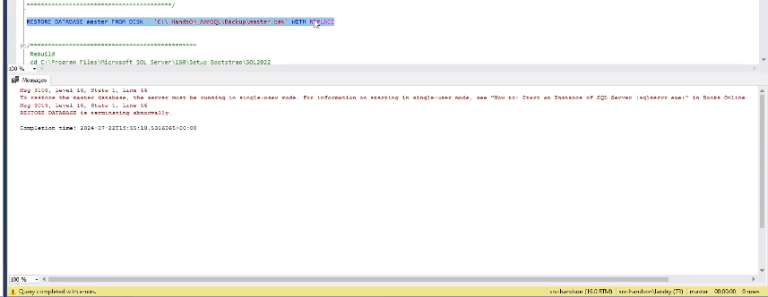
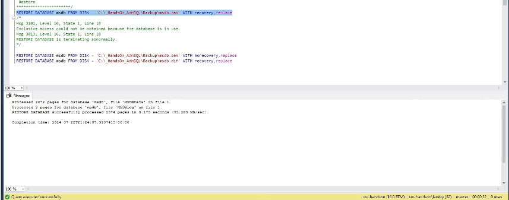
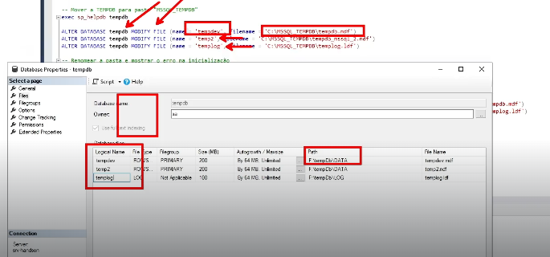
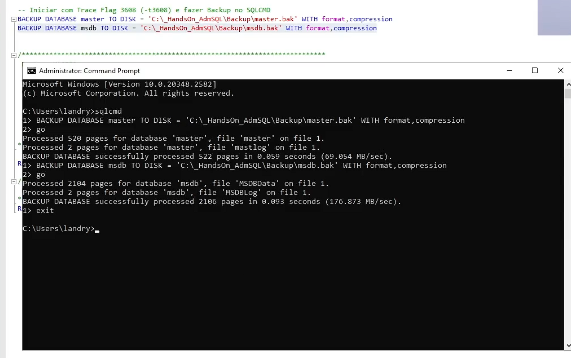

# 📘 Módulo 05 — Recuperando Banco Corrompido

---

# 📌 Contexto do Módulo

Este módulo foi focado em cenários críticos de recuperação e integridade no SQL Server, abordando técnicas utilizadas por DBAs para identificar, diagnosticar e recuperar bancos de dados corrompidos.

Durante as práticas foram explorados cenários reais envolvendo corrupção de páginas, recuperação de bancos de sistema e estratégias avançadas de disaster recovery.

Os laboratórios desenvolvidos neste módulo representam atividades extremamente importantes na rotina de administração de bancos de dados SQL Server em ambientes corporativos.

---

# 🎯 Objetivo

Desenvolver conhecimentos práticos relacionados a:

- Verificação de integridade do banco de dados
- Identificação de corrupção de páginas
- Recuperação de bancos corrompidos
- Utilização do DBCC CHECKDB
- Restore de página (Page Restore)
- Recuperação de bancos de sistema
- Disaster Recovery
- Troubleshooting avançado em SQL Server

---

# 📂 Estrutura do Módulo

```bash
modulo-05-recuperando-banco-corrompido/
│
├── PDFs/
│
├── Queries/
│   ├── 01_banco_corrompido.sql
│   ├── 02_restore_de_pagina.sql
│   ├── 03_recuperando_banco_master.sql
│   ├── 04_recuperando_banco_de_sistema_msdb.sql
│   ├── 05_recuperando_banco_de_sistema_tempdb.sql
│   └── 06_recuperando_banco_de_sistema_model.sql
│
├── Imagens/
│   ├── 01_01_banco_corrompido.png
│   ├── 02_01_restore_de_pagina.png
│   ├── 02_02_restore_de_pagina.png
│   ├── 02_03_restore_de_pagina.png
│   ├── 03_01_recuperando_banco_master.png
│   ├── 04_01_recuperando_banco_de_sistema_msdb.png
│   ├── 05_01_recuperando_banco_de_sistema_tempdb.png
│   └── 06_01_recuperando_banco_de_sistema_model.png
│
└── README.md
```

---

# 🧠 Conceitos Abordados

## 🔹 Corrupção de Banco de Dados

Foram estudados cenários envolvendo corrupção física e lógica de bancos de dados no SQL Server.

Também foram abordadas possíveis causas de corrupção:

- falha de hardware
- falha em disco
- problemas de memória RAM
- falhas de software
- corrupção de páginas

---

## 🔹 DBCC CHECKDB

Utilização da ferramenta:

```sql
DBCC CHECKDB
```

Responsável por:

- validar integridade física
- validar integridade lógica
- identificar páginas corrompidas
- detectar inconsistências estruturais

Também foram exploradas opções como:

- REPAIR_REBUILD
- REPAIR_ALLOW_DATA_LOSS

---

## 🔹 suspect_pages

Foi realizada análise da tabela:

```sql
msdb..suspect_pages
```

Utilizada pelo SQL Server para registrar páginas suspeitas ou corrompidas.

---

## 🔹 Restore de Página (Page Restore)

Implementação de recuperação granular utilizando:

- restore de páginas específicas
- NORECOVERY
- RECOVERY
- replay de transaction log

Esse processo permite recuperar páginas corrompidas sem necessidade de restaurar o banco inteiro.

---

## 🔹 Recuperação da MASTER

Estudo de recuperação do banco de sistema MASTER, responsável por armazenar:

- logins
- configurações da instância
- metadata do SQL Server
- informações dos bancos

Também foram abordados:
- startup em modo especial
- rebuild de bancos de sistema
- restore crítico da instância

---

## 🔹 Recuperação da MSDB

Foram realizados cenários de recuperação da MSDB, responsável por:

- SQL Agent Jobs
- histórico de backup
- manutenção
- Database Mail
- automações

---

## 🔹 Recuperação da TEMPDB

Análise da recuperação e recriação automática da TEMPDB, banco extremamente utilizado internamente pelo SQL Server para:

- operações temporárias
- ordenações
- HASH operations
- version store
- temp tables

---

## 🔹 Recuperação da MODEL

Foi estudada a recuperação da MODEL, utilizada como template para criação de novos bancos de dados.

Também foram abordados:
- rebuild de bancos de sistema
- reconstrução da instância
- recuperação operacional

---

# 📸 Evidências Práticas

## 🔹 Banco Corrompido e CHECKDB



---

## 🔹 Restore de Página







---

## 🔹 Recuperando Banco MASTER



---

## 🔹 Recuperando Banco MSDB



---

## 🔹 Recuperando Banco TEMPDB



---

## 🔹 Recuperando Banco MODEL



---

# 🧪 Aplicação Prática (Visão DBA)

Os cenários executados neste módulo representam atividades críticas realizadas por DBAs em ambientes corporativos:

- troubleshooting avançado
- disaster recovery
- recuperação de corrupção
- recuperação da instância
- recuperação de bancos de sistema
- continuidade operacional
- validação de integridade
- recuperação granular

Esse tipo de conhecimento é extremamente importante em ambientes produtivos, onde falhas podem gerar indisponibilidade e perda de dados.

---

# 📚 Aprendizados

Ao final deste módulo foi possível desenvolver conhecimentos em:

- corrupção de bancos de dados
- DBCC CHECKDB
- análise de integridade
- Page Restore
- recuperação da MASTER
- recuperação da MSDB
- recuperação da TEMPDB
- recuperação da MODEL
- troubleshooting SQL Server
- disaster recovery

---

# 🚀 Conclusão

Este módulo consolidou conhecimentos avançados relacionados à recuperação de bancos de dados no SQL Server.

Os cenários abordados representam situações reais enfrentadas por DBAs em ambientes corporativos, principalmente em cenários críticos envolvendo corrupção, falhas de infraestrutura e recuperação operacional.

Além do aprofundamento técnico em recuperação e integridade, o módulo também reforçou conceitos fundamentais de troubleshooting, continuidade de negócio e disaster recovery no SQL Server.
