# Módulo 06 - Tabelas e Índices

## 📖 Sobre o Módulo

Este módulo aborda conceitos fundamentais e avançados relacionados à estrutura de armazenamento, índices, otimização de consultas e recursos de performance no SQL Server.

Durante as aulas foram explorados tópicos essenciais para administração e otimização de bancos de dados, incluindo modelagem dimensional, índices tradicionais e Columnstore, estatísticas, fragmentação, particionamento, compressão de dados e Automatic Tuning.

Os exercícios práticos foram realizados utilizando SQL Server Management Studio (SSMS), permitindo compreender o funcionamento interno do mecanismo de armazenamento e processamento de consultas do SQL Server.

---

## 🎯 Objetivos de Aprendizagem

- Entender a estrutura física e lógica das tabelas.
- Trabalhar com diferentes tipos de índices.
- Compreender o impacto da fragmentação.
- Interpretar planos de execução.
- Analisar estatísticas utilizadas pelo otimizador.
- Implementar pesquisas Full-Text.
- Utilizar particionamento de tabelas.
- Aplicar compressão de dados.
- Conhecer recursos de Automatic Tuning e Query Store.

---

## 🛠️ Tecnologias Utilizadas

- SQL Server
- SQL Server Management Studio (SSMS)
- T-SQL
- Query Store
- Full-Text Search
- Columnstore Indexes

---

## 📂 Estrutura do Módulo

### Scripts Desenvolvidos

```text
01_create_table.sql
02_tipos_de_dados_string.sql
03_tipos_de_dados_numerico.sql
04_tipos_de_dados_data_e_hora.sql
05_constraints.sql
06_tamanho_maximo_da_linha.sql
07_forwarded_records.sql
08_create_index.sql
09_filtered_index.sql
10_criando_indices_columnstore.sql
11_indice_columnstore_clustered.sql
12_fragmentacao.sql
13_plano_de_execucao.sql
14_estatisticas.sql
15_like_indices_fulltext.sql
16_particionamento_de_tabelas.sql
17_compressao_de_dados.sql
18_automatic_tuning.sql
```

---

# 📸 Evidências Práticas

## ⭐ Modelo Estrela (Data Warehouse)

Modelo dimensional utilizado em cenários analíticos e Data Warehouse.

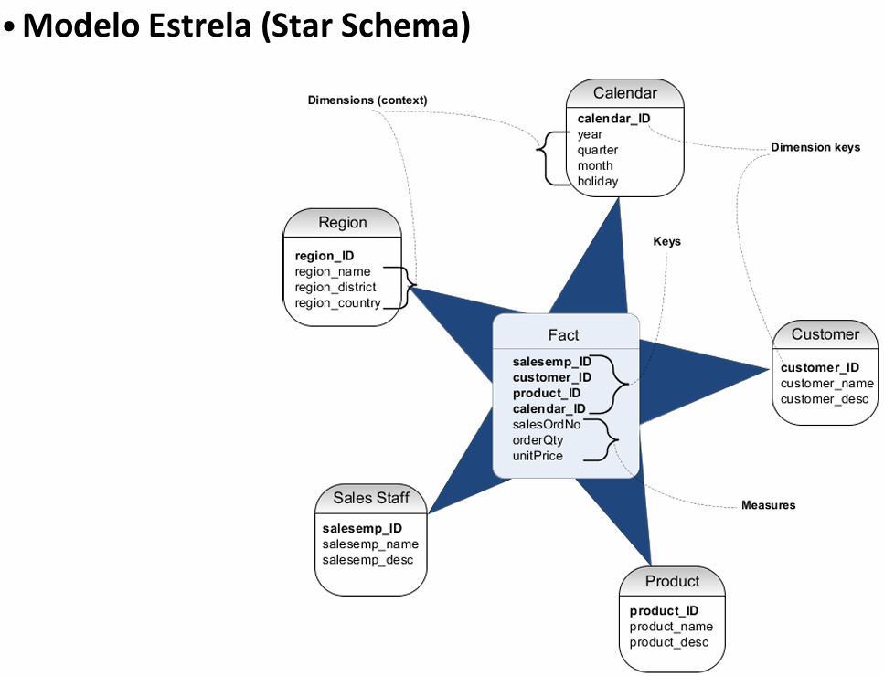

---

## 🔐 Constraints

Implementação de restrições para garantir integridade dos dados.

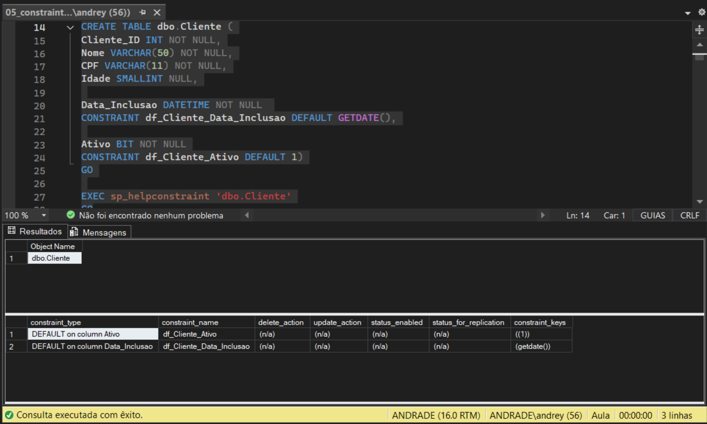

---

## 📄 Forwarded Records

Demonstração do comportamento de registros encaminhados em tabelas Heap.

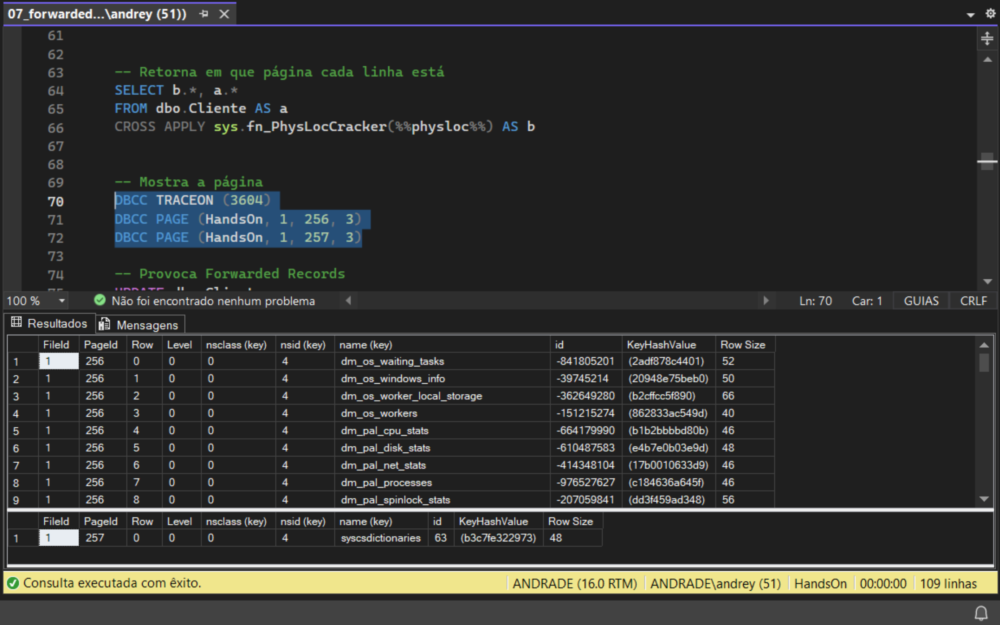

---

## 📊 Nonclustered Index

Criação e utilização de índices Nonclustered para otimização de consultas.

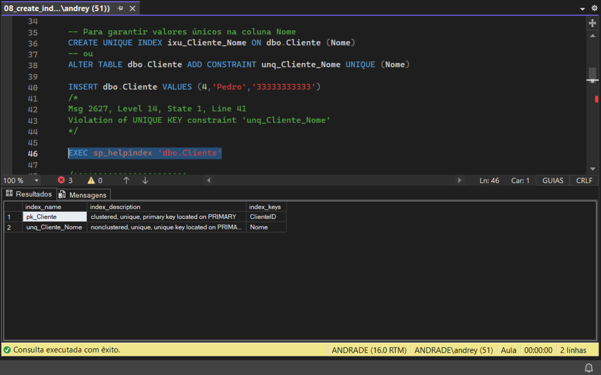

---

## 🎯 Filtered Index

Criação de índices filtrados para cenários específicos de consulta.

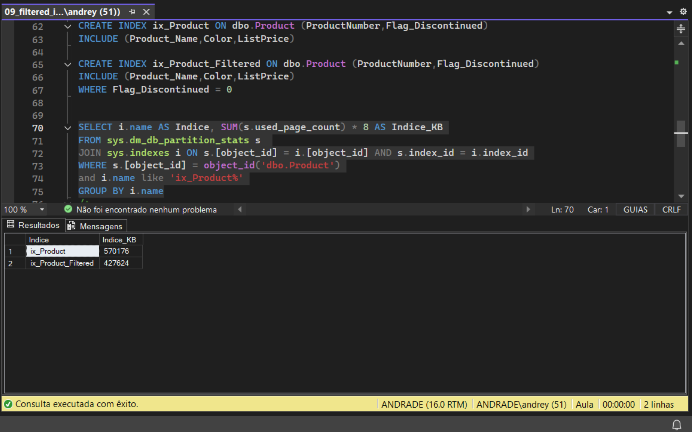

---

## 🚀 Columnstore Index

Implementação de índices Columnstore para workloads analíticos.

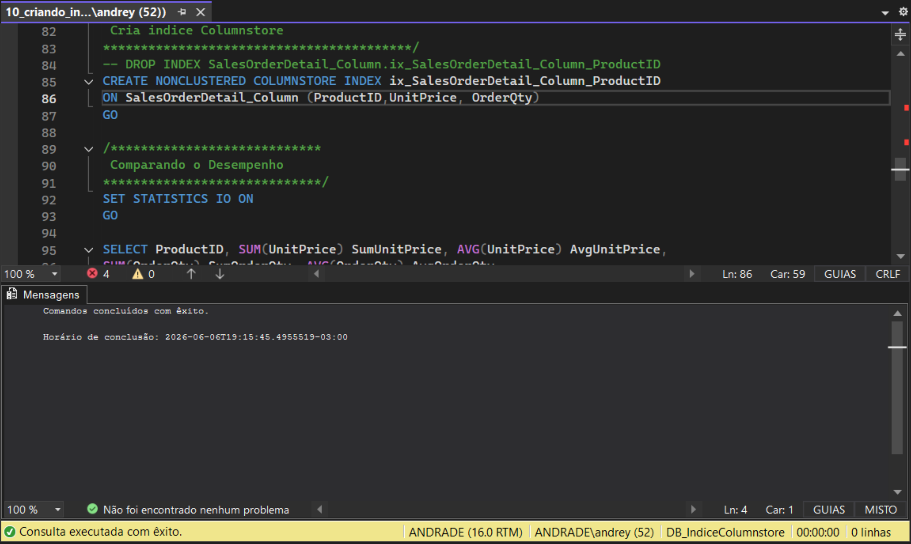

---

## 🏢 Clustered Columnstore Index

Utilização de Clustered Columnstore para grandes volumes de dados.

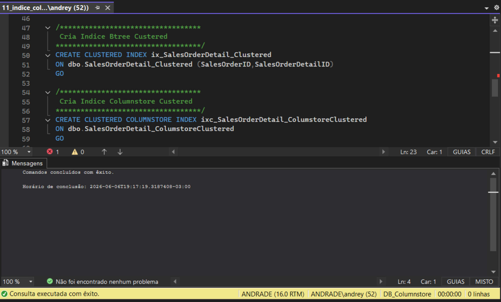

---

## 🔧 Fragmentação de Índices

Análise do nível de fragmentação dos índices.

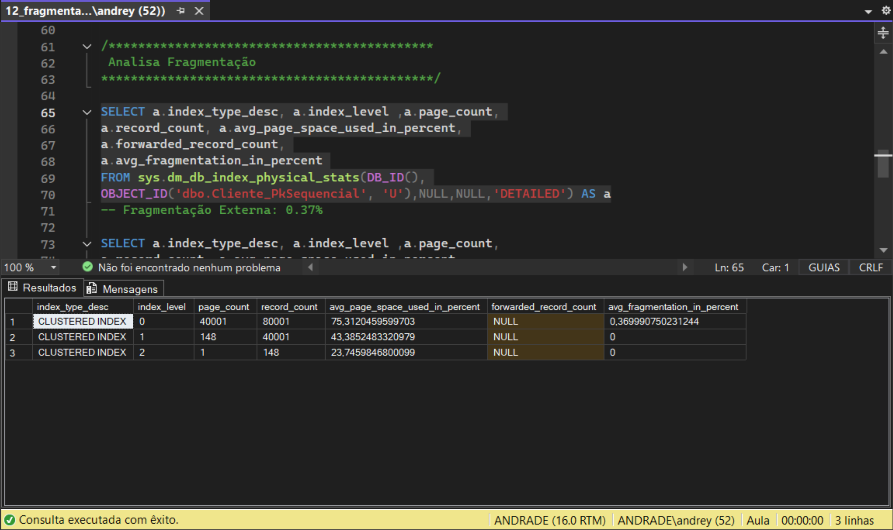

---

## 🛠️ Manutenção de Índices

Execução de operações de reorganização e reconstrução de índices.

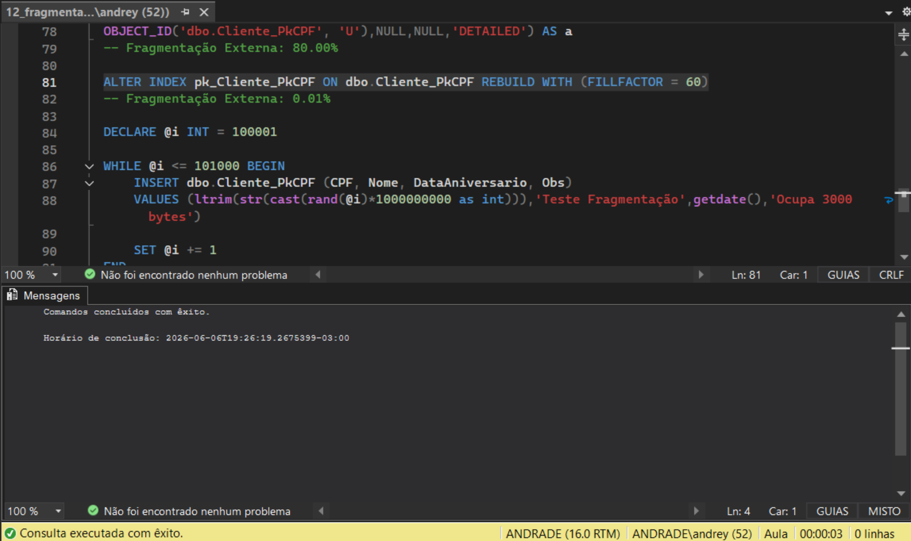

---

## ⚡ Plano de Execução

Análise gráfica dos planos de execução utilizados pelo otimizador.

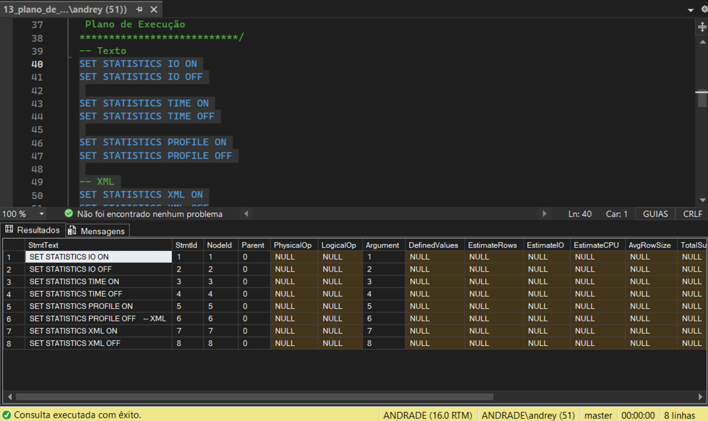

---

## 📈 Estatísticas

Avaliação das estatísticas utilizadas pelo Query Optimizer.

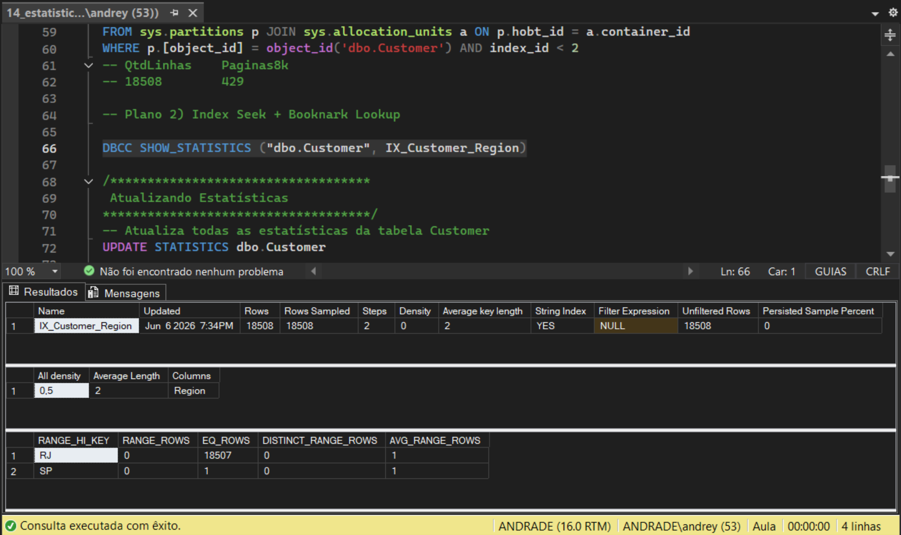

---

## 🔎 Full-Text Search

Implementação de pesquisas avançadas utilizando Full-Text Search.

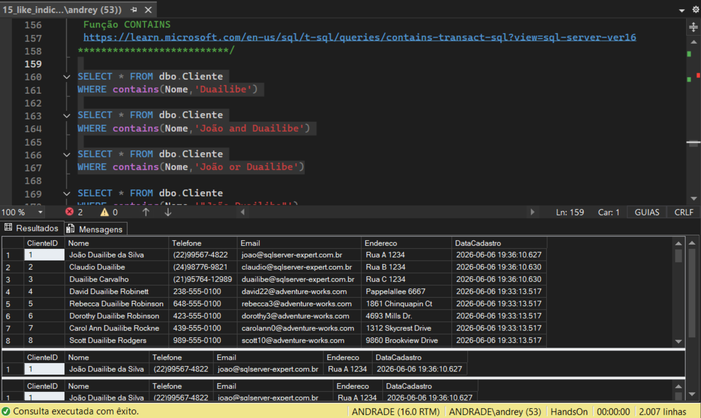

---

## 🗂️ Particionamento de Tabelas

Divisão lógica dos dados para melhorar desempenho e manutenção.

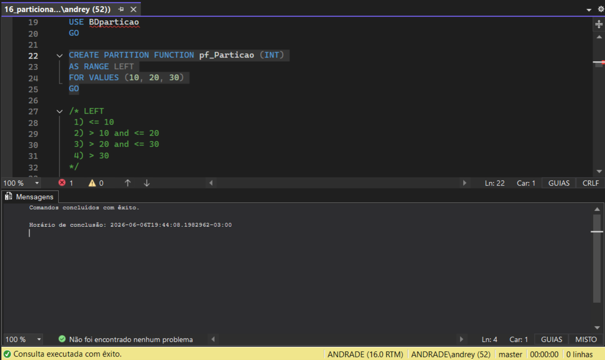

---

## 💾 Compressão de Dados

Aplicação de compressão para redução de espaço e otimização de I/O.

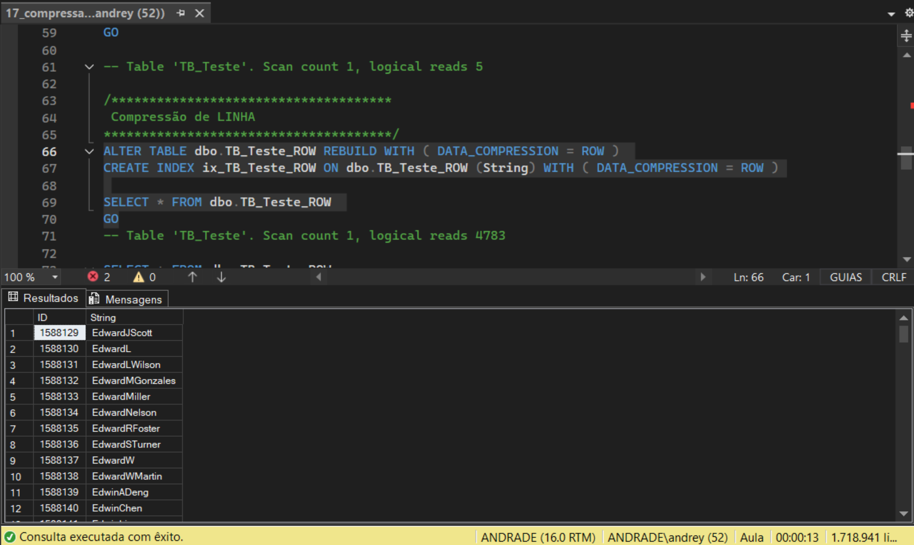

---

## 🤖 Automatic Tuning

Configuração e utilização dos recursos automáticos de otimização de desempenho.

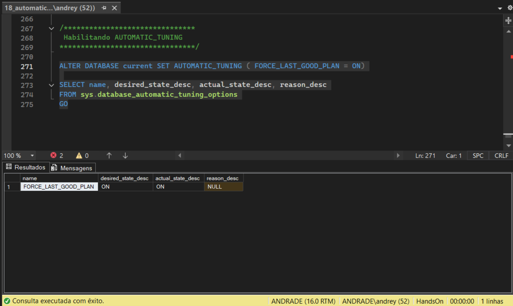

---

# 📚 Principais Conceitos Estudados

- Modelagem Dimensional
- Modelo Estrela
- Constraints
- Heap Tables
- Forwarded Records
- Clustered Index
- Nonclustered Index
- Filtered Index
- Columnstore Index
- Clustered Columnstore Index
- Fragmentação de Índices
- REBUILD e REORGANIZE
- Planos de Execução
- Estatísticas
- Query Optimizer
- Full-Text Search
- Particionamento de Tabelas
- Compressão de Dados
- Query Store
- Automatic Tuning

---

# 🚀 Competências Desenvolvidas

Ao concluir este módulo foram desenvolvidas competências relacionadas a:

- Estruturação de tabelas SQL Server.
- Administração de índices.
- Otimização de consultas.
- Análise de performance.
- Diagnóstico de problemas de execução.
- Gerenciamento de grandes volumes de dados.
- Técnicas de armazenamento avançadas.
- Recursos modernos de tuning automático.

---

## 👨‍💻 Autor

**Andrey Andrade**

Projeto desenvolvido como parte da formação SQL Server Expert, com foco na construção de portfólio para atuação em Banco de Dados, Administração SQL Server e Engenharia de Dados.
