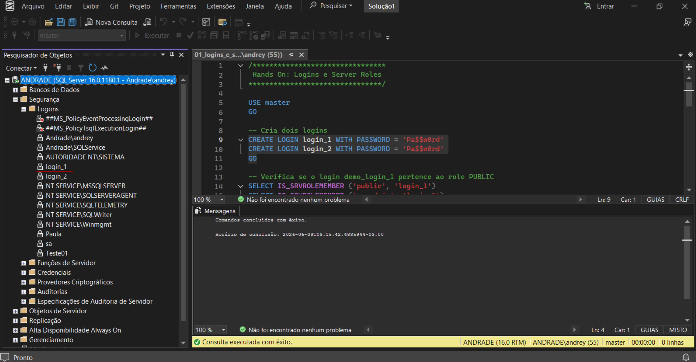
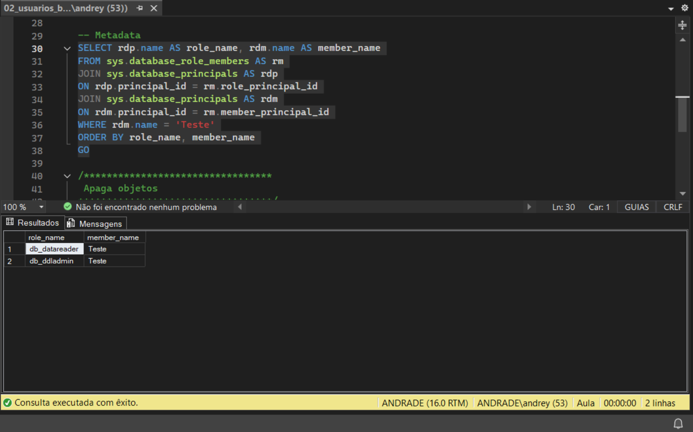
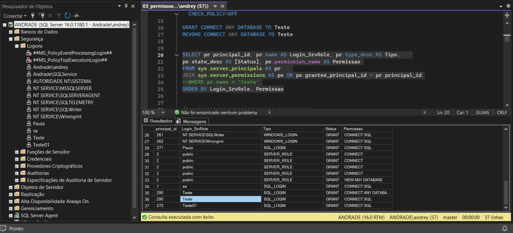

# 📘 Módulo 07 --- Segurança SQL Server

------------------------------------------------------------------------

# 📌 Contexto do Módulo

Este módulo foi focado nos principais recursos de segurança do SQL
Server, abordando controle de acesso, gerenciamento de permissões,
auditoria, rastreabilidade e proteção de dados.

Durante as práticas foram explorados recursos utilizados por DBAs em
ambientes corporativos para garantir segurança, controle e conformidade
das informações armazenadas.

Os laboratórios desenvolvidos neste módulo representam cenários reais
envolvendo administração de usuários, monitoramento de alterações,
auditoria de eventos e proteção de dados sensíveis.

------------------------------------------------------------------------

# 🎯 Objetivo

Desenvolver conhecimentos práticos relacionados a:

-   Administração de Logins e Users
-   Server Roles e Database Roles
-   Controle de permissões
-   Auditoria de eventos
-   Auditoria através de Triggers
-   SQL Server Audit
-   Histórico de alterações
-   Temporal Tables
-   Ledger
-   Criptografia de dados
-   Dynamic Data Masking

------------------------------------------------------------------------

# 📂 Estrutura do Módulo

``` bash
modulo-07-seguranca/
│
├── PDFs/
│
├── Queries/
│   ├── 01_logins_e_server_roles.sql
│   ├── 02_usuarios_bd_e_database_roles.sql
│   ├── 03_permissoes.sql
│   ├── 04_usuarios_orfaos.sql
│   ├── 05_copiar_login_com_senha.sql
│   ├── 06_default_trace.sql
│   ├── 07_auditoria_trigger_ddl.sql
│   ├── 08_auditoria_trigger_logon.sql
│   ├── 09_auditoria_trigger_dml.sql
│   ├── 10_server_audit.sql
│   ├── 11_temporal_table.sql
│   ├── 12_ledger.sql
│   ├── 13_criptografia.sql
│   └── 14_dynamic_data_masking.sql
│
├── Imagens/
│   ├── 01_01_logins_e_server_roles.png
│   ├── 02_01_usuarios_bd_e_database_roles.png
│   ├── 03_01_permissoes.png
│   ├── 04_01_usuarios_orfaos.png
│   ├── 05_01_copiar_login_com_senha.png
│   ├── 06_01_default_trace.png
│   ├── 07_01_auditoria_trigger_ddl.png
│   ├── 08_01_auditoria_trigger_logon.png
│   ├── 09_01_auditoria_trigger_dml.png
│   ├── 10_01_server_audit.png
│   ├── 11_01_temporal_table.png
│   ├── 12_01_ledger.png
│   ├── 13_01_criptografia.png
│   └── 14_01_dynamic_data_masking.png
│
└── README.md
```

------------------------------------------------------------------------

# 🧠 Conceitos Abordados

## 🔹 Logins e Server Roles

Foram estudados os mecanismos de autenticação da instância SQL Server.

Conceitos abordados:

-   Criação de Logins
-   Gerenciamento de acesso à instância
-   Server Roles
-   Controle de privilégios administrativos

------------------------------------------------------------------------

## 🔹 Usuários e Database Roles

Foi estudada a relação entre Login e User dentro dos bancos de dados.

Estrutura:

    Login
     ↓
    User
     ↓
    Database Role

Foram aplicados conceitos de:

-   Criação de usuários
-   Associação com bancos
-   Organização de permissões através de roles

------------------------------------------------------------------------

## 🔹 Permissões

Foram aplicados comandos de controle de acesso:

``` sql
GRANT
DENY
REVOKE
```

Utilizados para controlar acesso a objetos como:

-   tabelas
-   views
-   procedures
-   recursos do banco

------------------------------------------------------------------------

## 🔹 Auditoria com Default Trace

Foi realizada análise de eventos registrados pelo SQL Server.

O recurso permite investigar alterações realizadas no ambiente.

Foram analisados eventos como:

-   criação de objetos
-   alterações administrativas
-   ações realizadas por usuários

------------------------------------------------------------------------

## 🔹 Auditoria com Triggers

Foram desenvolvidas auditorias utilizando triggers.

Tipos abordados:

### DDL

Monitoramento de alterações estruturais:

-   CREATE
-   ALTER
-   DROP

### LOGON

Monitoramento de conexões realizadas na instância.

### DML

Auditoria de alterações nos dados:

-   INSERT
-   UPDATE
-   DELETE

------------------------------------------------------------------------

## 🔹 SQL Server Audit

Implementação do recurso nativo de auditoria do SQL Server.

Utilizado para:

-   registrar eventos
-   identificar usuários
-   acompanhar ações realizadas no ambiente

------------------------------------------------------------------------

## 🔹 Temporal Tables

Foi estudado o versionamento automático de dados.

Aplicações:

-   histórico de alterações
-   consulta de dados em determinado momento
-   rastreabilidade

------------------------------------------------------------------------

## 🔹 Ledger

Implementação de auditoria com integridade criptográfica.

Objetivos:

-   garantir confiabilidade do histórico
-   proteger registros contra alterações indevidas

------------------------------------------------------------------------

## 🔹 Criptografia

Foram aplicados conceitos de proteção de dados utilizando:

-   Master Key
-   Certificados
-   Chaves simétricas
-   AES
-   EncryptByKey
-   DecryptByKey

------------------------------------------------------------------------

## 🔹 Dynamic Data Masking

Aplicação de mascaramento de dados para limitar exposição de informações
sensíveis.

Exemplos:

-   CPF
-   Email
-   Telefone
-   Dados pessoais

------------------------------------------------------------------------

# 📸 Evidências Práticas

## 🔹 Logins e Server Roles



------------------------------------------------------------------------

## 🔹 Usuários e Database Roles



------------------------------------------------------------------------

## 🔹 Permissões



------------------------------------------------------------------------

## 🔹 Auditoria SQL Server


------------------------------------------------------------------------

## 🔹 SQL Server Audit


------------------------------------------------------------------------

## 🔹 Histórico de Dados


------------------------------------------------------------------------

## 🔹 Proteção de Dados


------------------------------------------------------------------------

# 🧪 Aplicação Prática (Visão DBA)

Os cenários executados neste módulo representam atividades realizadas
por DBAs em ambientes corporativos:

-   gerenciamento de acessos
-   controle de privilégios
-   auditoria de alterações
-   investigação de eventos
-   proteção de informações sensíveis
-   rastreamento de histórico
-   segurança de dados

------------------------------------------------------------------------

# 📚 Aprendizados

Ao final deste módulo foi possível desenvolver conhecimentos em:

-   segurança SQL Server
-   autenticação e autorização
-   permissões
-   auditoria
-   triggers
-   SQL Server Audit
-   Temporal Tables
-   Ledger
-   criptografia
-   mascaramento de dados

------------------------------------------------------------------------

# 🚀 Conclusão

Este módulo consolidou conhecimentos fundamentais de segurança no SQL
Server.

Os cenários praticados representam situações reais encontradas na
administração de bancos de dados, principalmente relacionadas a controle
de acesso, auditoria, conformidade e proteção de informações.

A implementação desses recursos reforça a importância da segurança como
parte essencial da rotina de um DBA.
