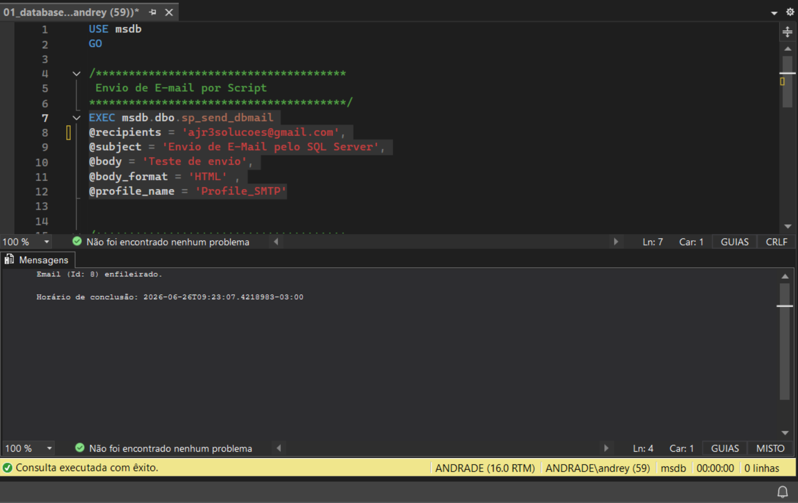
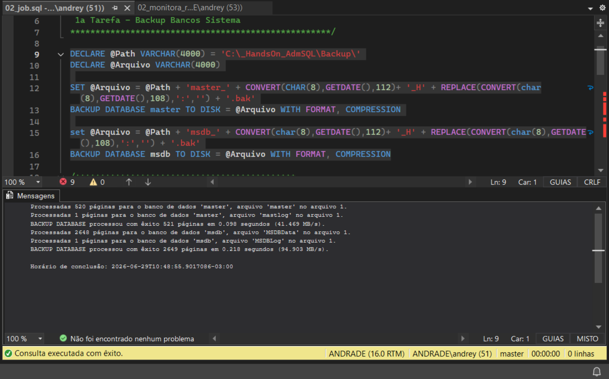
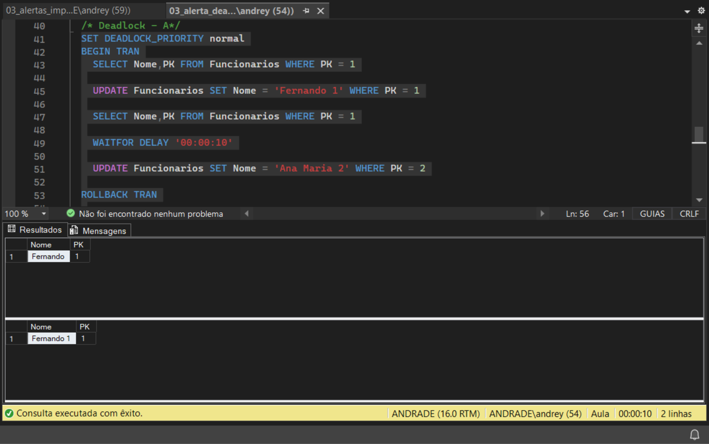
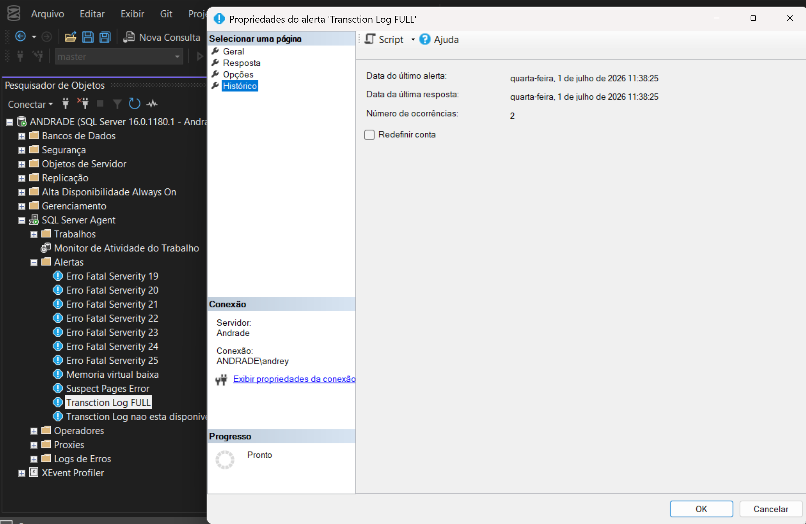
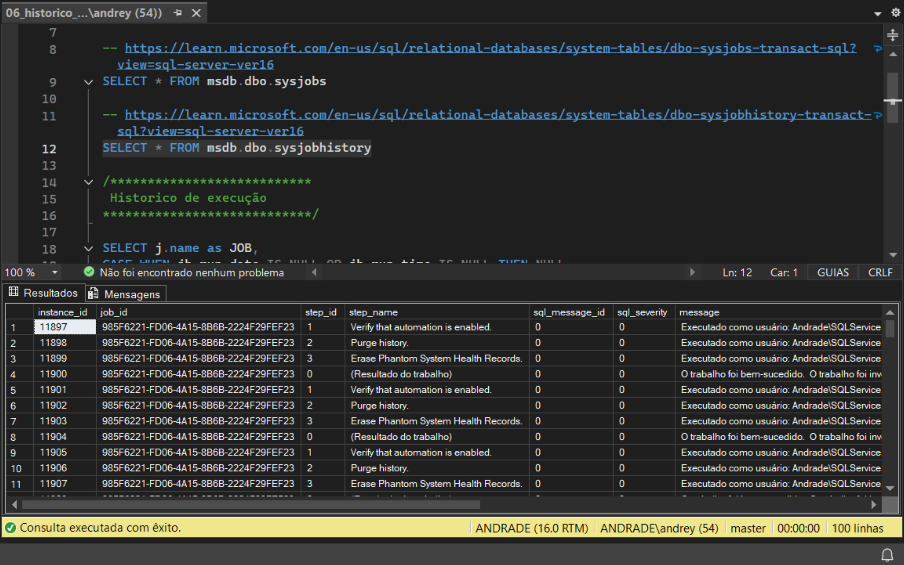
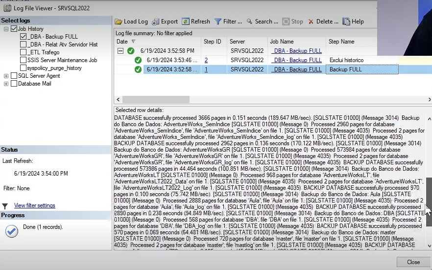
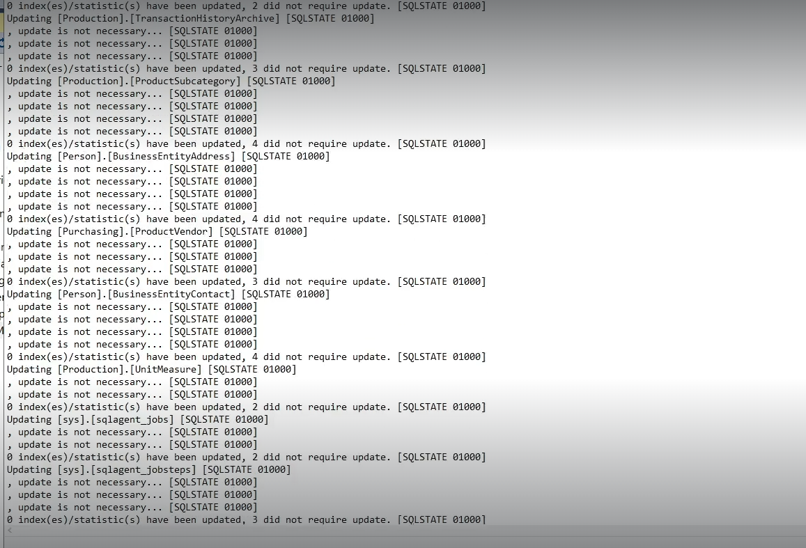
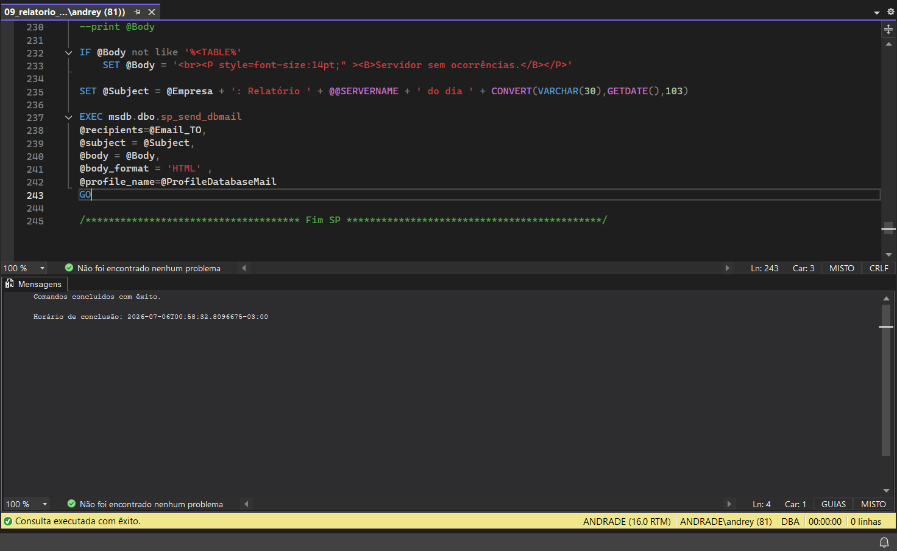

# 📘 Módulo 09 — Automatizando Tarefas

---

# 📌 Contexto do Módulo

Este módulo foi dedicado à automação de tarefas administrativas no SQL Server utilizando recursos nativos como **Database Mail**, **SQL Server Agent**, **Jobs**, **Alertas**, **Backups automatizados**, **Manutenção de Índices** e **Relatórios por e-mail**.

As práticas simulam atividades executadas diariamente por DBAs para reduzir intervenções manuais, aumentar a disponibilidade do ambiente e padronizar processos operacionais.

---

# 🎯 Objetivo

Desenvolver conhecimentos práticos relacionados a:

- Configuração do Database Mail
- Criação e gerenciamento de Jobs
- Agendamento de tarefas
- Monitoramento da instância
- Configuração de Alertas
- Consulta ao histórico de Jobs
- Automação de Backups Full, Diferencial e Log
- Manutenção automatizada de índices
- Envio de relatórios administrativos por e-mail

---

# 📂 Estrutura do Módulo

```text
modulo-09-automatizando-tarefas/
│
├── PDFs/
├── Queries/
│   ├── 01_databasemail.sql
│   ├── 02_job.sql
│   ├── 02_monitora_reinicio_sql.sql
│   ├── 03_alerta_deadlock.sql
│   ├── 03_alertas_importantes.sql
│   ├── 04_alerta_contador.sql
│   ├── 06_historico_dos_jobs.sql
│   ├── 07_backup_de_todos_os_bancos_full.sql
│   ├── 07_backup_de_todos_os_bancos_dif.sql
│   ├── 07_backup_de_todos_os_bancos_log.sql
│   ├── 08_manutencao_indices.sql
│   └── 09_relatorio_servidor_por_email.sql
│
├── Imagens/
└── README.md
```

---

# 🧠 Conceitos Abordados

## 🔹 Database Mail
Configuração de perfis de e-mail para envio automático de notificações administrativas.

## 🔹 SQL Server Agent
Criação de Jobs, Steps e Agendamentos para automatizar rotinas operacionais.

## 🔹 Monitoramento
Implementação de Jobs para detectar reinicializações da instância e eventos relevantes.

## 🔹 Alertas
Configuração de alertas para Deadlocks, eventos importantes e Performance Counters.

## 🔹 Histórico dos Jobs
Consulta ao histórico de execução utilizando a base **msdb**.

## 🔹 Estratégia de Backup
Automação de Backups Full, Diferencial e Log visando recuperação de desastres.

## 🔹 Manutenção de Índices
Rotinas para reorganização e reconstrução de índices a fim de manter o desempenho do banco.

## 🔹 Relatórios Automatizados
Geração e envio de relatórios administrativos por e-mail utilizando Database Mail.

---

# 📸 Evidências Práticas

## Database Mail


## SQL Server Agent


## Alerta de Deadlock


## Alerta por Contador


## Histórico dos Jobs


## Backup Automatizado


## Manutenção de Índices


## Relatório do Servidor


---

# 🧪 Aplicação Prática (Visão DBA)

As rotinas implementadas representam atividades comuns de um Administrador de Banco de Dados:

- Automação de processos recorrentes.
- Monitoramento proativo do ambiente.
- Configuração de notificações automáticas.
- Estratégias de backup e recuperação.
- Manutenção preventiva de índices.
- Auditoria através do histórico de Jobs.
- Geração de relatórios operacionais.

---

# 📚 Aprendizados

Ao final deste módulo foi possível desenvolver conhecimentos em:

- Database Mail
- SQL Server Agent
- Jobs e Agendamentos
- Alertas
- Performance Counters
- Histórico de Jobs
- MSDB
- Backup Full
- Backup Diferencial
- Backup Log
- Manutenção de Índices
- Relatórios automáticos

---

# 🚀 Conclusão

Este módulo consolidou conhecimentos fundamentais sobre automação administrativa no SQL Server. As práticas desenvolvidas aproximam o ambiente de laboratório de cenários encontrados em produção, reforçando competências essenciais para atuação como DBA, especialmente em monitoramento, manutenção preventiva, automação de rotinas e alta disponibilidade.

O conteúdo complementa os módulos anteriores do portfólio e amplia a experiência prática em administração do SQL Server.
